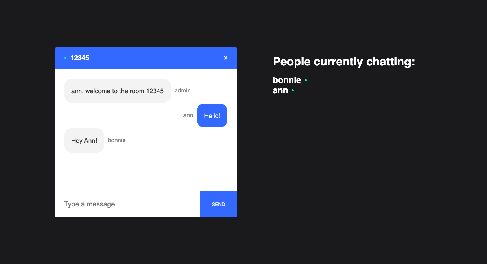

# Chat App 

## Chat App 
This chat app was made with the help of the following tutorial, https://www.youtube.com/watch?v=ZwFA3YMfkoc&t=6341s and its corresponding code, https://github.com/adrianhajdin/project_chat_application

## How it was Built
* Frontend: React, CSS 
* Backend: Javascript | Express | Node.js | socket.io

## What I Learned
This was my first experience working with React and Node. Given the widespread usability and potential applications of chats, I thought that this was a good place to start. Going into this project, I wanted to develop a better understanding of MERN stack for use in future hackathons and for the superghost-app project. Ultimately, I was able to gain a better grasp of not only the technical aspects (i.e. asynchronous calbacks and sockets) but also develop a good structure for file organization. 

## What's Next.
* Integration into Superghost game
* Implement a code generator and a create room function 
* Use of cookies to mantain sessions
* Explore use of database for mantaining room codes

